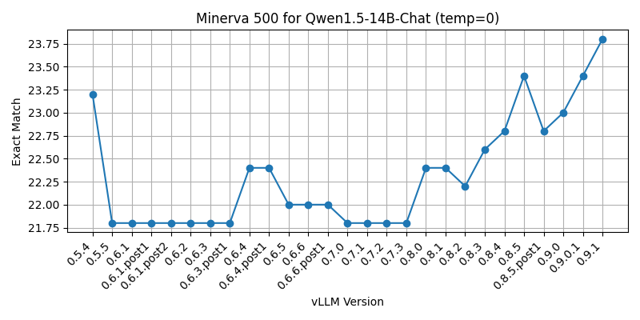

Eval on multiple versions of vLLM



### Quick start

```sh
pip install -e .
```

```sh
python src/main.py \
    --package=vllm==0.8.2 \
    --model=Qwen/Qwen1.5-14B-Chat
```

```sh
# See available vLLM packages
curl -s https://pypi.org/pypi/vllm/json | jq -r '.releases | keys[]'
```

### On Beaker

```sh
# Launch a single job
gantry run \
    --name vllm-debug \
    --cluster ai2/augusta-google-1 \
    --beaker-image ai2/cuda12.8-dev-ubuntu22.04-notorch \
    --budget ai2/oe-eval \
    --workspace ai2/olmo-3-evals \
    --priority high \
    --timeout -1 \
    --gpus 1 \
    --allow-dirty \
    -- \
python src/main.py \
    --package=vllm==0.1.6 \
    --model=Qwen/Qwen1.5-14B-Chat
```

```sh
# Launch jobs on the cluster!
python beaker/launch_jobs.py

# Gather results
python beaker/pull_results.py

# Render figure
python beaker/render_results.py
```